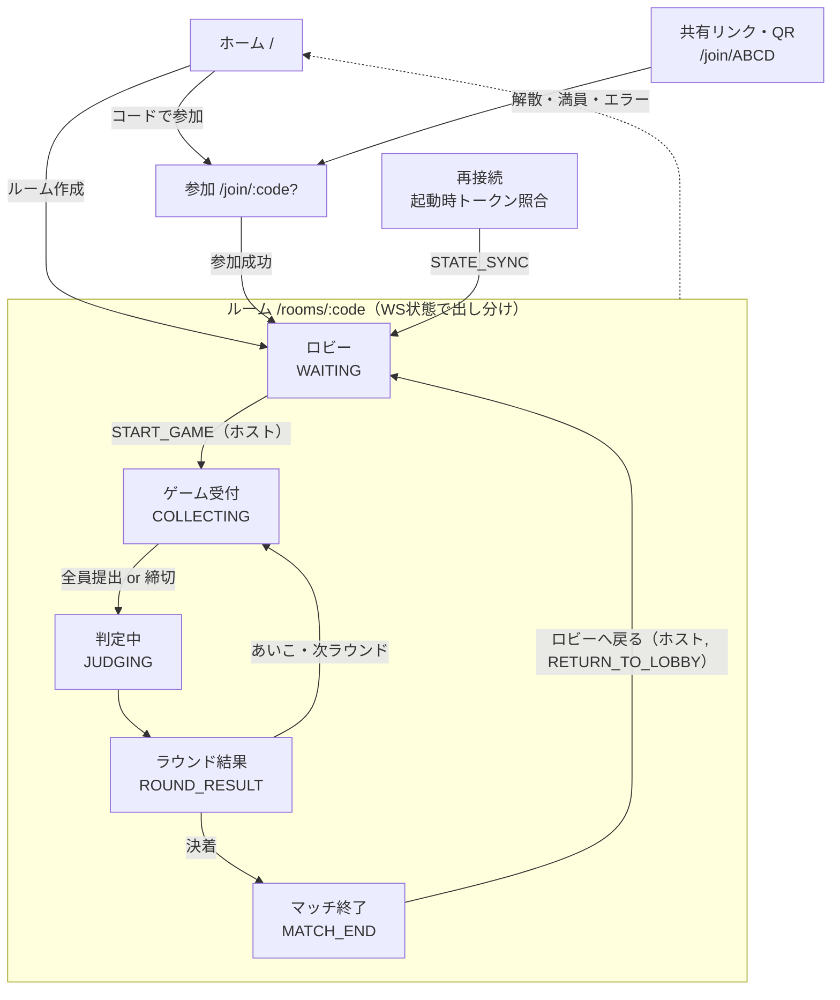

# Screen Flow Specification

フロントエンド（React + Vite + TypeScript / SPA）の画面遷移仕様。
リアルタイム性を踏まえ、**入口のみ URL ルートで管理し、ルーム入室後は WebSocket のゲーム状態で表示を出し分ける**。

## 1. ナビゲーションの基本方針

- **入口だけ URL ルートで持つ**: `/`（ホーム）, `/join/:code?`（参加）。共有リンク / QR は `/join/ABCD` を指す。
- **ルーム入室後（`/rooms/:code`）は単一ルートのまま、サブ画面（ロビー / ゲーム / 結果）を WebSocket のゲーム状態でレンダリング**する。サブ画面を別 URL にすると realtime 状態と URL がズレやすいため、状態駆動で切り替える。
- **再接続**: 起動時に LocalStorage の `roomCode` / `playerToken` があれば自動で `/rooms/:code` へ復帰し、`STATE_SYNC` で正しいサブ画面を復元する（§3 参照）。

## 2. 画面一覧（ルート対応）

| 画面                   | ルート / 表示条件            | 主な内容                                                             |
| ---------------------- | ---------------------------- | -------------------------------------------------------------------- |
| ホーム                 | `/`                          | 「ルームを作成」「コードで参加」                                     |
| ルーム作成             | `/`（モーダル）              | 表示名入力 → 作成 → ロビーへ                                         |
| 参加                   | `/join/:code?`               | コード＋表示名入力（リンク経由はコード自動入力）                     |
| **ルーム**（状態駆動） | `/rooms/:code`               | 下記サブビューを WS 状態で切替                                       |
| └ ロビー               | `Room.status = WAITING`      | 参加者一覧・コード / QR 共有・**対戦履歴**・ホスト設定パネル・開始ボタン（ホスト） |
| └ ゲーム（受付）       | `Match.state = COLLECTING`   | 手札選択・締切タイマー・提出状況（手は秘匿）                         |
| └ 判定中               | `Match.state = JUDGING`      | 「判定中…」ローディング                                              |
| └ ラウンド結果         | `Match.state = ROUND_RESULT` | 勝敗 / 脱落 / スコア・手動時はホストに「次へ」                       |
| └ マッチ終了           | `Match.state = MATCH_END`    | 勝者・最終スコア・「ロビーへ戻る」（ホスト, `RETURN_TO_LOBBY`）→ ロビー |
| エラー / 終了          | 任意                         | ルーム無し / 満員 / 解散 → ホームへ誘導                              |

## 3. 画面遷移図



## 4. ホスト設定パネル（ロビー内）

ロビー画面に埋め込むパネル。ホストには編集可能、ゲストには同一内容の**読み取り専用ビュー**を表示する。設定は `MatchConfig`（`ARCHITECTURE.md` §9）に対応する。

### 4.1 レイアウト（モバイルファースト）

ロビーを縦積みで構成し、共有エリア → **対戦履歴** → 参加者一覧 → 設定パネル → 開始ボタンの順に並べる（区切り線で各ブロックを分割）。

```text
共有エリア
  ルーム: AB3K        [QR] [コード] [リンク]
────────────────────────────────
対戦履歴                    [ 更新 ]
  #3  通常  14:32  勝者: Alice
  #2  通常  14:28  勝者: Bob
  #1  通常  14:20  引き分け
  （0 件時は「まだ対戦履歴がありません」）
────────────────────────────────
参加者 (4/20)              [ ＋CPUを追加 ]  ← ホストのみ / ALLOW_CPU 時
  • Alice (ホスト)
  • Bob   • Carol
  • 🤖 CPU-1 [ 削除 ]        ← CPU はバッジ表示 / ホストに削除ボタン
────────────────────────────────
ゲーム設定 〔ホストのみ編集可〕
  ルール       [ 通常 ▼ ]
  終了方式     ( 脱落式 ) / 1ラウンド   ← 通常ルール時
  制限時間     [ ——●—— ] 10秒
  進行         ( 自動 ) / 手動
  あいこ上限   [ − ] 5 [ + ]
  …(ルール別の追加項目)
────────────────────────────────
  ※設定はゲーム開始時に確定
  [ ゲーム開始 ]  (条件未達は非活性)
```

### 4.2 設定項目

> 既定値・許容範囲の**正本は `ARCHITECTURE.md` §9**（サーバーの `MatchConfig` で検証）。下表はその値に対応する UI 表現（コントロール種別・刻み・表示条件）であり、数値を §9 と乖離させない。

| 項目                        | コントロール           | 範囲 / 選択肢                       | 既定値 | 表示条件                                                                       |
| --------------------------- | ---------------------- | ----------------------------------- | ------ | ------------------------------------------------------------------------------ |
| `rule_type`                 | セレクト or セグメント | 通常 / 少数派 / 代表 / トーナメント | 通常   | 常時（`TODO.md` R6 実装済み） |
| `normal_end_mode`           | トグル                 | 脱落式 / 1ラウンド確定              | 脱落式 | `rule_type=通常` のみ                                                          |
| `round_time_limit_sec`      | スライダー＋数値       | 5〜60秒（5刻み）                    | 10秒   | 常時                                                                           |
| `round_advance_mode`        | トグル                 | 自動 / 手動                         | 自動   | 常時                                                                           |
| `result_display_sec`        | スライダー＋数値       | 1〜10秒（1刻み）                    | 3秒    | `round_advance_mode=自動` のみ                                                 |
| `max_draw_rounds`（あいこ上限） | ステッパー         | 1〜20                               | 5      | 常時                                                                           |
| `minority_finish_threshold` | ステッパー             | 2〜（参加者数−1）                   | 2      | `rule_type=少数派` のみ                                                        |
| `minority_finish_timing`    | トグル                 | 即時 / 次マッチから                 | 即時   | `rule_type=少数派` のみ                                                        |
| `boss_player_id`            | 参加者セレクト         | 参加者一覧                          | 未選択 | `rule_type=代表` のみ                                                          |

- ルール別項目は `rule_type` に応じて**動的に出し分け**（条件表示）。
- 少数派・代表・トーナメントは**選択肢として表示するが非活性**（`SettingsPanel`）。backend の判定ロジック（`game/rules/*`）は実装済み。`RoundRunner` / `ws.py` 統合（`TODO.md` R0–R5）とゲーム画面対応（R6）完了後に有効化する。

### 4.2.1 ゲーム画面 — 特殊ルール（`TODO.md` R6 実装済み）

ランタイム統合完了まで NORMAL 用 UI のみ。統合後に追加する表示・操作:

| ルール | ゲーム画面の追加要素 |
|--------|---------------------|
| MINORITY | 生存者数の強調。NORMAL 決着へ移行した旨の表示（`switched_to_normal_finish`） |
| BOSS | `MatchView.boss_player_id` に基づくボスバッジ。`ROUND_RESULT` / `MATCH_END` の `scores` 表示。ボスも手を出す UI |
| TOURNAMENT | 自分の `segment_id` のペアのみ手札 UI・残り時間。他ペアは結果サマリー（任意）。`SUBMIT_HAND` に `segment_id` を付与 |

再接続時は `STATE_SYNC` の `MatchView`（TOURNAMENT では所属ペアの `deadline_at`）を権威とする（`ARCHITECTURE.md` §7.1）。

### 4.1.1 QR コード共有（未実装）

- **現状**: `SharePanel` でルームコード・参加リンク（`/join/:code`）のコピーのみ。
- **予定**: `[QR]` ボタン → `ShareQrModal`（`react-qr-code`）で QR 表示。**実装済み**。

### 4.3 ライブ同期の挙動

- 各変更は `UPDATE_SETTINGS`（ホスト→サーバー）→ `SETTINGS_UPDATE`（全員へブロードキャスト）で**即時に全員のパネルへ反映**。
- スライダー等の連続値は**デバウンス（例 300ms）**してから送信する。
- 確定は `START_GAME` 時（パネルに「設定はゲーム開始時に確定」を明示）。
- 編集中にホストが交代した場合、新ホストのクライアントが編集権を引き継ぐ（`HOST_CHANGED` 受信で編集可へ切替）。

### 4.4 バリデーションと「ゲーム開始」ボタン

- **最小人数**（ルール別）を満たすまで開始ボタンは**非活性**＋理由表示:
    - 通常 ≥2 / 少数派 ≥3 / 代表 ≥2（＋ボス）/ トーナメント ≥2
    - 最小人数の母集団は `ARCHITECTURE.md` §4.2 の集合 `S`（非観戦かつ CONNECTED な人間＋CPU。観戦者・開始時切断中の人間は除く）を正とする。
- `boss_player_id` 未選択（代表時）や、`minority_finish_threshold` が参加者数に対して不整合な場合も非活性。
- **`boss_player_id` の参照整合**: 指名済みのボスが退出して在室しなくなった場合は開始不可（非活性）。サーバーは `START_GAME` 再検証で在室を確認し、不在なら `START_CONDITION_UNMET` を返す（指名者退出時に `boss_player_id` を `null` にリセットして周知してもよい。`ARCHITECTURE.md` §8）。
- クライアント側の表示制御に加え、**サーバー側でも開始条件を再検証**する（不正な `START_GAME` は `ERROR`）。

### 4.5 ゲスト（非ホスト）表示

- 同じ項目を**読み取り専用**で表示（「ホストが設定中」ラベル、コントロールは disabled）。
- 開始ボタンは非表示とし、待機メッセージ「ホストの開始を待っています」を表示する。

### 4.6 対戦履歴パネル（ロビー内）

ロビー（`WAITING`）に埋め込む折りたたみ可能なパネル。ホスト・ゲストとも**同一内容**を閲覧する（読み取り専用）。

- **データ源**: REST `GET /rooms/{code}/matches`（`ARCHITECTURE.md` §3.1）。WebSocket では通知しない。
- **取得タイミング**: ロビー表示時（`WAITING` 遷移）の初回、`RETURN_TO_LOBBY` 後の再表示、手動「更新」ボタン。フロントは **SWR**（`useMatchHistory`）で取得・再検証する。
- **表示内容（1 行あたり）**: ルール種別（`rule_type` ラベル）・終了時刻（`ended_at` をローカル表示）・勝者（`winner_ids` → `players` の `display_name`。CPU は 🤖）・`scores` があるルールでは得点。`winner_ids` が空のときは「引き分け」。
- **状態表示**: 読込中（スピナー等）／0 件／エラー（`503` 等 → 「履歴を読み込めませんでした」＋再試行）。
- **表示しない場所**: `MATCH_END` 画面（直前の結果は `MatchEndView` が WS `MATCH_END` で表示済みのため重複を避ける）。
- **別 URL は設けない**: ルーム内サブビューは WS 状態駆動の方針（§1）に従い、履歴もロビー内パネルに留める。

## 5. 補足仕様・判断

- **ルーム作成**: ホームの**モーダル**で表示名を入力する（専用ルートは設けず、画面数を増やさない）。
- **観戦中の途中参加者**: ロビー以外（ゲーム進行中）に入室した参加者は「次のマッチを待っています」バナーを出しつつ、進行中の**ラウンド結果・マッチ結果は読み取り専用で観戦表示**する（手の提出 UI は出さない。配信範囲は `ARCHITECTURE.md` §6）。`MATCH_END → ロビー` のタイミングで通常参加に合流する。
- **ホスト操作の出し分け**: 設定パネル・開始 / 次へ / 「ロビーへ戻る」ボタンは**ホストのトークンを持つクライアントのみ**に表示する。「ロビーへ戻る」は `RETURN_TO_LOBBY` を送り、サーバーが `Room.status` を `WAITING` へ戻すまで結果画面（`MATCH_END`）を表示し続ける（`ARCHITECTURE.md` §6）。表示制御はあくまで UX 上のもので、**権限の最終検証はサーバー側**でも行う。
- **エラー導線**: ルーム無し / 満員 / 解散 / トークン不正は `ERROR`（コード付き）を受けてホームへ誘導し、理由を表示する。
- **開発/デモ用 CPU プレイヤー**: ロビーの参加者エリアに、ホストのみ・`ALLOW_CPU` 有効時のみ「＋CPUを追加」ボタンを表示する（押下で `ADD_CPU` を送信）。CPU は参加者一覧で**ロボットバッジ（🤖）付き**で表示し、各 CPU 行にホスト用「削除」ボタン（`REMOVE_CPU`）を出す。CPU は定員・開始最小人数にカウントされるため、ソロでも「ゲーム開始」が活性化する。CPU 行には手の提出 UI・観戦表示は出さない（CPU 自身のクライアントは存在しない）。`ALLOW_CPU=false` 環境では追加ボタンを出さず、サーバーは `CPU_NOT_ALLOWED` を返す（`ARCHITECTURE.md` §3/§4.1/§11）。
- **ルーム操作**: 退室・別ルーム参加・新規ルーム作成の UI（`RoomActionsPanel` / `useExitRoom`）。試合中（`IN_GAME` かつ `MATCH_END` 以外）は移動系を非活性。WS の `LEAVE` → `disconnect` → セッションクリアの手順は `ARCHITECTURE.md` §3。

## 6. 関連ドキュメント

- ゲーム状態（`Room` / `Match` / `Round`）と FSM: `ARCHITECTURE.md` §5・§6
- WebSocket メッセージ種別（`STATE_SYNC` / `LOBBY_UPDATE` / `ROUND_START` ほか）: `ARCHITECTURE.md` §4
- 対戦履歴 REST（`GET /rooms/{code}/matches`）: `ARCHITECTURE.md` §3.1
- ホスト設定項目（`MatchConfig`）: `ARCHITECTURE.md` §9
- 機能要件（ルーム管理・対戦履歴閲覧）: `REQUIREMENTS.md` §3
